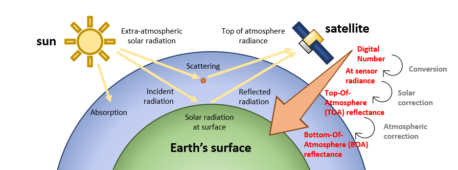
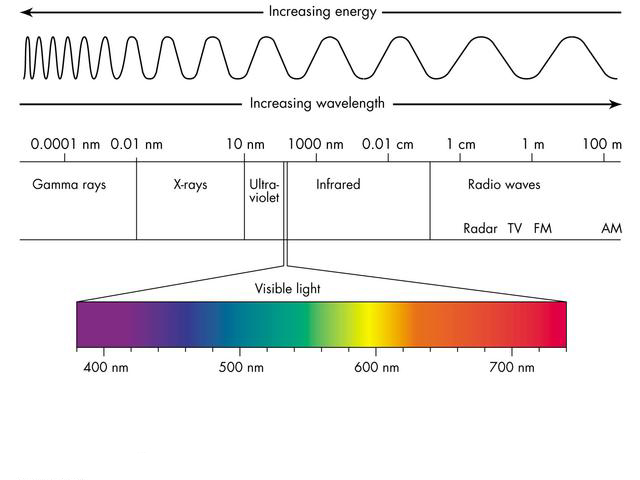

The aim of this document is to show how to handle **multispectral imagery** in `R` from major **publicly-available data archives**. These materials teach you the basic/intermediate concepts to retrieve, manage, and process satellite images locally (in your computer) in a simple and effective manner with `rsat`. The package is intended to deal with time series of satellite images from various sources in a standardized, semi-automated, and efficient manner. `rsat` replaces `RGISTools`, our previous package ($\sim 7500$ downloads), with a simpler, more efficient, and extended workflow. Materials are organized as follows:

i.  **Introduction** - theory about multispectral images, data types and their organization.
ii. **Tinkering with satellite `records`** - standardizing and filtering image metadata.
iii. **Managing your `rtoi`** - building your region and time of interest.
iv. **Basic processing** - customizing images for the objectives of the study.
v.  **More advance processing** - completing and harmonizing multi-source data sets.

------------------------------------------------------------------------

## Introduction

In this introductory section, the goal is understanding the basic notions of multispectral images (Section \@ref(theory-images)) and clarify how they are organized in the data archives (Section \@ref(theory-archives)). Both are helpful to determine what images to use and where to find them. We won't explain both aspects in detail but enough to understand the code and its intention. Alongside explanations, we run embedded code examples so it is key that your software is up-to-date.

------------------------------------------------------------------------

### Software installation

Check that you are using the latest version of `R` and `RStudio`. Otherwise, click [here](https://cran.r-project.org/bin/windows/base/) and [here](https://rstudio.com/products/rstudio/download/) to install both (in that order). Then, use the following commands to install `rsat` from our [Github repository](https://github.com/spatialstatisticsupna/rsat):

```{r eval=FALSE}
# load devtools library
library(devtools)

# Install rsat from the GitHub repositoy
install_github("spatialstatisticsupna/rsat")
```

Additional data and provisional procedures are available in another package called `rsatExtra`. Run the following lines to install it:

```{r eval=FALSE}
# Install rsatExtra from the GitHub repositoy
install_github("spatialstatisticsupna/rsatExtra")
```

#### Linux

If you are using Linux, you need to install some additional libraries before installing `R`. See the commands below to install all the applications for *Debian/Ubuntu* and *RedHat/Fedora*.

#### *Debian/Ubuntu*

        sudo apt update
        sudo apt install r-cran-rcpp gdal-bin libgdal-dev libproj-dev libssl libssl-dev xml2 libxml2-dev libmagick++-dev

#### RedHat/Fedora

        sudo dnf install gdal gdal_devel proj_devel xml2 libxml2_devel libcurl_devel openssl_devel ImageMagick-c++_devel

------------------------------------------------------------------------

## Multi-spectral images {#theory-images}

As mentioned earlier, `rsat` allows you to access and process ***optical satellite images*** (for now). We focus on this type of images because it is perhaps one of the most popular data products. It has proven to be a very valuable source of information in many fields such as ecology, agronomy, hydrology, or economic sciences. Note that satellites can provide several other data products beyond multispectral images, e.g. aerosol or atmospheric gas concentrations, digital elevation models (DEMs), etc.

Multispectral satellite images are measurements of ***electromagnetic radiation*** captured by ***passive*** (*vs.* active) sensors aboard satellites. Passive sensors measure the radiation emitted by external sources like the sun (*vs.* emitting radiation themselves). The sun emits radiation which passes through the atmosphere an reaches the earth's surface, where it is absorbed or reflected. Reflected radiation travels again through the atmosphere to the sensing device. On its way through the atmosphere, light is absorbed or scattered due to interaction of radiation with atmospheric particles.

{width="658" height="255"}

Sensors, atmosphere, topography, and the sun distort the radiation measurements. Data providers pre-process the images to compensate for these disturbances. There are several ***processing levels*** depending on the corrections applied. For convenience, in this course we deal with *Level 2*. *Level 2* images provide the ***surface reflectance*** - reflected radiation relative to the incident radiation as would be measured close to ground level. Surface reflectance is a ratio so it has no units and values usually range between $0$ and $1$. *Level 2* images are comparable in space and time. Even though *Level 2* is the primary focus in these tutorials, `rsat` also gives you access to lower or higher processing levels if needed.

Correction algorithms are constantly updated or improved. When the upgraded algorithms is applied to pre-existing and new images, data providers release a new ***collections or versions*** . For instance, until few months ago, Landsat imagery had available their [Collection 1](https://www.usgs.gov/core-science-systems/nli/landsat/landsat-collection-1?qt-science_support_page_related_con=1#qt-science_support_page_related_con). They recently enhanced their algorithms and they just created the [Collection 2](https://www.usgs.gov/core-science-systems/nli/landsat/landsat-collection-2?qt-science_support_page_related_con=1#qt-science_support_page_related_con).

{width="470"}

Electromagnetic radiation can be described as a continuous ***spectrum*** of wavelengths. Our eyes perceive a small portion of the entire spectrum ($400-700nm$), which is referred to as visible spectrum. Sensors on board satellites capture slices of the spectrum, called ***bands***, in and beyond the visible range. We talk about ***multispectral*** images when the number of bands is in the order of $10$s and ***hyperspectral*** when it is in the order of $100$s. Objects and colors can be detected thanks to the distinctive amount of radiation (***intensity***) that they reflect in each band.

------------------------------------------------------------------------

## Data structure {#theory-archives}

### Programs, missions, and satellites

Multispectral images are freely available thanks to satellite ***programs*** supported by public agencies. The three major satellite programs are [Landsat](https://landsat.gsfc.nasa.gov/) (NASA/USGS), [MODIS](https://www.copernicus.eu/es) (NASA), and [Copernicus](https://www.copernicus.eu/es) (ESA).

Programs can develop one or several ***missions*** and, for each mission, agencies launch one or multiple satellites to meat a particular goal (e.g., weather observation, land monitoring, sea-level surveillance). For instance, the Landsat program has carried out 8 missions so far (Landsat-1/8) and there is a 9th on the making (launch scheduled on spring 2021).

Missions are accomplished by ***satellites*** which carry specific ***sensors*** or instruments for the task. When several satellites are devoted to a single mission they are referred to as ***constellations***. For instance, the Terra and Aqua satellites from the constellation of the MODIS mission. A list of on-going governmental programs and their missions, satellites, and sensors can be found below.

### Data products

#### Tiling systems

Sensors scan the earth's surface in a continuous fashion. Data records are deliberately broken into pieces so they can be processed and shared more easily. The divisions follow a pre-established grid system formed by cells or ***tiles*** (e.g., see the interactive map below). We recommend you to know in advance which tiles cover your area of interest, even though the tile selection is made automatically by `rsat` .

<center>

{width="459"}

\<\center\>

Tiling systems differ among programs/missions:

-   **Landsat 4-8:** The tiling system is the [*World Reference System 2*](https://landsat.gsfc.nasa.gov/about/worldwide-reference-system). Tiles are identified according to their path and row numbers which specify their location from East to West and North to South respectively.

-   **Sentinel-2**: Uses the [Military Grid System](https://hls.gsfc.nasa.gov/wp-content/uploads/2016/03/MGRS_GZD-1.png). In this system, the earth's surface is divided into 60 vertical zones (UTM zones) and 20 horizontal zones. Vertical strata are designated by numbers increasing from East to West. Horizontal segments are represented by letters from South to North.

-   **MODIS:** Divides the earth according to the [Sinusoidal tile grid system](https://modis-land.gsfc.nasa.gov/MODLAND_grid.html). Tiles are identified based on their horizontal and vertical location in a regular grid. Here also the numbers increase from East to West and North to South**.**

The tiling systems mentioned above are available as polygons in `rsatExtra`. These polygons can be loaded and used to check the overlap between the *ROI* and the tiles. Let's display the sinusoidal tile grid system from MODIS;

```{r, fig.align='center', fig.cap = "MODIS Tiling system"}
library(rsatExtra)
library(tmap)
data("modis_tiles")
tmap_mode('view')
tm_shape(modis_tiles) + tm_polygons(alpha = 0, border.col = "red")
```

#### Product characteristics

The orbit and sensors of satellites/constellations provide images of different resolutions (in its broadest sense). Here, the term ***resolution*** refers to the level of detail in some aspect of the image:

-   ***Spatial resolution*** is related to the area covered by a single pixel. High-resolution images contain small pixels, i.e. they cover small surface areas. Among the missions mentioned before, Sentinel-2 is the one offering images with the highest resolution ( $\sim 10\times 10m$ per pixels).

-   ***Temporal resolution*** is related to the time span between two successive images. When images are frequent, they provide a high temporal resolution. For instance, MODIS Terra and Aqua revisit daily so it the program with the highest temporal resolution. Another aspect to consider is the temporal extension of data products. Because satellites are launched and decommissioned, their associated products are available for a limited period of time.

-   The **spectral resolution** corresponds to the number of bands and their wavelength range. The MODIS sensor, with its $36$ bands in total, is the sensor with the highest spectral resolution.

    . Source: USGS"){width="429"}

Selecting the right product depends on the objective of the study and the extension of the *ROI*. The features of different missions and satellites are collected into a single look-up table [here](https://drive.google.com/file/d/1cSw4LaTLPlGBHmG8v7uwH54f-m9jZz1N/view?usp=sharing). Web services

#### Names

As mentioned earlier, these tutorial mostly concern ***multispectral images*** capturing ***surface reflectance*** values (`rsat` gives access to products with other levels of pre-processing). Short-names or ***ID**s* identify the data products . The product names for the on-going missions are listed below. We rely on `rsat`'s manual and tables like the one below to remember the *IDs* of each data product. After a while you will learn them by heart.

```{r data_table, echo=FALSE, message=FALSE, warning=FALSE, results='asis'}
library(pander)
data <- "
  Program    | Mission    | Satellite | Sensor | ID             
  Landsat    | Landsat-7  | Landsat-7 | ETM    | Landsat_ETM_C1
  Landsat    | Landsat-8  | Landsat-8 | OLI    | Landsat_8_C1
  MODIS      | MODIS      | Terra     | MODIS  | MOD09GA
  MODIS      | MODIS      | Aqua      | MODIS  | MYD09GA
  Copernicus | Sentinel-2 | 2A        | MSI    | S2MSI2A
  Copernicus | Sentinel-2 | 2B        | MSI    | S2MSI2A
  Copernicus | Sentinel-3 | 3A        | OLCY   | SY_SYN__
  Copernicus | Sentinel-3 | 3B        | OLCY   | SY_SYN__
"
df <- read.delim(textConnection(data),header=FALSE,sep="|",strip.white=TRUE,stringsAsFactors=FALSE)
names(df) <- unname(as.list(df[1,]))
df <- df[-1,]
row.names(df)<-NULL
pander(df, style = 'rmarkdown', caption = "Operational missions collecting multi-spectral satellite images and their relevant details")
```

### Web services

Information collected from satellites is saved in repositories which can be freely accessed using ***web services***. Web services work as an interface between the user and the data repositories, finding and retrieving the requested data-sets to the user. In order to obtain multispectral images from the three programs, sign-up in the following web services. For convenience, try to use the same *username* and *password* for all of them. To satisfy the criteria of all web services make sure that the *username* is $4$ characters long and includes a period, number or underscore. The password must be $12$ character long and use characters (at least one capital letter) and numbers:

-   **EarthData** : [\<https://urs.earthdata.nasa.gov/users/new\>](https://urs.earthdata.nasa.gov/users/new){.uri}

-   **Scihub** : [\<https://scihub.copernicus.eu/dhus/\#/self-registration\>](https://scihub.copernicus.eu/dhus/#/self-registration){.uri}

-   **EarthExplorer**: [\<https://ers.cr.usgs.gov/register\>](https://ers.cr.usgs.gov/register){.uri}

#### Demo \#1: MODIS download using the EarthExplorer portal

Web services offer online portals to request remote sensing products via *Graphical User Interfaces (GUI)*. We will conduct a small demonstration using *EarthExplorer's* GUI to find MODIS images covering Navarre between `03/05/2019` and `05/05/2019`. In our jargon, Navarre is referred to as ***Region of Interest (ROI)*** and the time-span is our ***Time of Interest (TOI)***.

1.  Go [here](https://earthexplorer.usgs.gov/) and log-in. The web page sends you to a new site. The website displays a menu on the left and a map on the right. Search Navarre on the map. Pick the polygon tab on the menu and draw a polygon around the region (see the gif below). Fill-in the starting and ending dates in the appropriate field of the form (at the bottom). Then click the *Data Sets* button.

    

2.  Select the data product on the panel on your left. Find for instance the *MOD09GA* product (we explain below what this is) expanding the menu under *NASA LPDAAC Collections*. Then click on *MODIS Land Surface Reflectance V6*. Pick the *MOD09GA* product and click on *Results.* A pop-up message appears indicating the system is searching the available images.

    

3.  The results are displayed on the left. You should see three results (one image for each day). You could download the image by clicking on the icon with a green arrow pointing downwards, and then repeat the process with every image in the list.

    

Data portals are straightforward and intuitive. However, they can be tedious when requesting images for longer periods of time or several data products. In these situations, `rsat` becomes handy. The package enables you to send requests from `R` to the appropriate web service easily and programatically using *Application Programming Interfaces (APIs)*. You can judge in the next section where the same example is repeated using `rsat`.

## `rsat`: Quick walkthrough

In this section, we repeat the previous demo but this time using `rsat`. The aim is to have an overview of the package's workflow and show how downloading satellite images can be acomplished with a few lines of code. The process is very similar to the online portal; (1) specify *username* and *pasword*, (2) define the *ROI* and *TOI,* (3) search, and (4) download the search results.

### Credentials

Two functions in `rsat` help us handling the *usernames* and *passwords* for the various APIs; `set_credentials()` and `print_credentials()`*.* The function `set_credentials()` indicates to `rsat` which `username` (first argument) and `password` (second argument) should be used for which `service` (third argument). The code below assigns to `scihub` our personal *username* and *password* :

```{r, cache = TRUE, cache.path="cache/"}
library(rsat)
set_credentials("rsat.package","UpnaSSG.2021","scihub")
```

The function `print_credentials()` displays on all the *usernames* and *passwords* required in `rsat` to gain full access to products handled by `rsat`. Undefined credentials remain empty (`""`):

```{r, cache = TRUE, cache.path="cache/"}
print_credentials()
```

If *usernames* and *passwords* are the same for all web services (our advice), we can set all of them with a single instruction :

```{r echo=FALSE}
# set API credentials
set_credentials("rsat.package", "UpnaSSG.2021")
```

### Region and time of interest: `rtoi`

The next step is to define the region and time of interest, which in `rsat` is an `rtoi` class object (`S6`). An `rtoi` (which sounds like `R` toy) contains all the relevant information regarding a specific remote sensing analysis. To initialize an `rtoi`, it is enough to define; (1) the region, (2) a path to save the raw data, and (3) another path to save the processed data.

In this walkthrough, the study region is available in `rsat`. The variable `ex.navarre` is a geo-referenced polygon of the region (`sf` class object). In future lessons, you will learn how to specify your own location. To load the polygon type;

```{r warning=FALSE, cache=TRUE, cache.path="cache/"}
data("ex.navarre")
```

Our paths are `db.path` and `rtoi.path` for saving the raw and the processed data sets:

```{r warning=FALSE, cache=TRUE, cache.path="cache/"}
# path for the database
db.path <- file.path("Z:/CursoRSAT/DATABASE")
# path where r
rtoi.path <- file.path("Z:/CursoRSAT/regions")
# create the folder for the database
dir.create(db.path, recursive = TRUE)
dir.create(rtoi.path, recursive = TRUE)
```

To create an `rtoi` use the function `new_rtoi()` as follows:

```{r warning=FALSE, cache=TRUE, cache.path="cache/"}
# rtoi
navarre <- new_rtoi(name = "Navarre",
                    region = ex.navarre,
                    db_path = db.path,
                    rtoi_path = rtoi.path)
```

### Search

The time of interest (`toi`) is a collection of dates. As in the demo, the `toi` should span from `03/05/2019` to`05/05/2019`. We can create a vector of dates typing:

```{r warning=FALSE, cache=TRUE, cache.path="cache/"}
toi <- as.Date("2019-05-03") + 0:2
```

With all this, everything is ready to search. Use the function `sat_search()`, specifying the `rtoi`, the name or the data product (`mod09ga`), and the dates you are interested in;

```{r warning=FALSE, cache=TRUE, cache.path="cache/"}
# search in the APIs
sat_search(region = navarre,
           product = c("mod09ga"),
           dates = toi)
```

`sat_search()` transfers the request to the *appropriate* web service. The function updates the `rtoi` with the response. Following chapters show how to preview the search results and apply additional filters. For now, let's have a look to the `rtoi`:

```{r warning=FALSE, cache=TRUE, cache.path="cache/"}
navarre
```

### Download

The function `download()` reads the search results from the `rtoi` and acquires the images (only those that are missing). The data goes straight to the database location (`db.path`):

```{r warning=FALSE, cache=TRUE, cache.path="cache/"}
download(navarre)
```

### Mosaicking

The function `mosaic()` binds images of the same date from different tiles whenever is required. It additionally crops the image around the *ROI*. The resulting color images can be plotted with `plot()`.

```{r warning=FALSE, cache=FALSE, cache.path="cache/"}
mosaic(navarre)
tmap_mode("plot")
plot(navarre,"mod09ga")
```

```{r, eval=FALSE, echo=FALSE}
unlink("Z:/CursoRSAT/regions/Navarre",recursive = TRUE)
```

------------------------------------------------------------------------

## Exercise

Your turn: We want you to search ([***do not download!***]{.ul}) the multispectral images captured by Landsat-8 (`"LANDSAT_8_C1"`), Sentinel-2 (`"S2MSI2A"`) and MODIS (`"mod09ga"`) in Navarre during May $2019$. Try to do it with one single `sat_search()` instruction. Use [***your own credentials***]{.ul} to check your access to the different data portals.

```{r, eval=FALSE, echo=FALSE}


```
