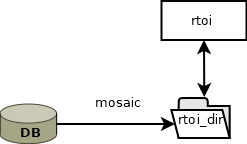
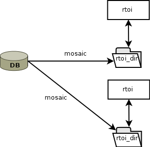

The aim of this document is to show how to handle multispectral imagery in R from major publicly-available data archives. These materials teach you the basic/intermediate concepts to retrieve, manage, and process satellite images locally (in your computer) in a simple and effective manner with `rsat`.

Materials are organized as follows:

i.  **Introduction** - theory about multispectral images, data types and their organization.
ii. **Tinkering with satellite `records`** - standardizing and filtering image metadata. (yesterday)
iii. [**Managing your `rtoi` - building your region and time of interest. (today)**]{.ul}
iv. **Basic processing** - customizing images for the objectives of the study. (tomorrow)
v.  **More advance processing** - completing and harmonizing multi-source data sets.

------------------------------------------------------------------------

# Managing your region and time of interest

Satellites capture images of the earth's surface from north to south. This capture is divided into tiles to reduce the size of the image. However, when the object of analysis is a region, these tiles must be rejoined.

{width="365"}

The tiling problem escalates to the search process. In the previous session the search result provided a records class. The records class is designed to work on quadrants, but our analysis will rarely be done on a single tiles. To deal with regions the package implements the `rtoi` class. This session will introduce what is the problem to manage a region only with records, and how to use both records and `rtoi` to search, filter, and download satellite images of a region.

## Searching images for you region

This session will use the Madrid region as a reference. The objective will be to get one image of Madrid from Landsat-8 and Sentinel-2, without clouds.

### Set credentials

Before we begin, we must assign the credentials. We will use the function set_credentials.

```{r, cache=TRUE ,eval=TRUE, cache.path="cache/"}
library(rsat)

# set API credentials
set_credentials("rsat.package", "UpnaSSG.2021")
```

### Get the region of Madrid

Our analysis will be based on the region of Madrid (Comunidad de Madrid). To obtain the region we will use the `getData` function of the `raster` package.

```{r, cache=TRUE ,eval=TRUE, cache.path="cache/"}
library(raster)
spain<-getData('GADM', country='Spain',path="D:/rsat/CursoRSAT/countries",level=2)
plot(spain)
unique(spain$NAME_1)
madrid.sp<-spain[spain$NAME_1=="Comunidad de Madrid",]
madrid.sf<-st_as_sf(madrid.sp)
```

### Search records of Madrid

Let's see what we get if we do a search of the region.

```{r, cache=TRUE ,eval=TRUE, cache.path="cache/"}
search.dates <- as.Date("2020-01-01") + 0:395

# search in the APIs
search.result<-rsat_search(region = madrid.sf,
                          product = c("S2MSI2A","LANDSAT_8_C1"),
                          dates = search.dates,
                          lvl=2)
class(search.result)
```

The search result gives more than 800 records, however if we look at the unique dates we can see only 200 days.

```{r, cache=TRUE ,eval=TRUE, cache.path="cache/"}
# show the number of records
length(search.result)
# show the number of dates
length(unique(dates(search.result)))
```

### Plotting Madrid tiles

What happens if we show all the records for one day and one product?

```{r, cache=TRUE ,eval=TRUE, cache.path="cache/"}
# plot records of one date
sentinel2.records <- subset(search.result,"Sentinel-2",subset = "sat")

date1 <- unique(dates(sentinel2.records))[1]
print(date1)
# show the number of dates
records.date1 <- sentinel2.records[dates(sentinel2.records)%in%date1]
plot(records.date1,region=madrid.sf)
```

## Why use an `rtoi`?

rtoi is the object designed to manage regions consisting of several tiles. The object is composed of 3 parts:

1.  The database address (db_path);

2.  The object loaded in R;

3.  The folder with all the processed data of the region of interest.

In the R environment, `rtoi` is a special object of R cataloged as object S6. The object behaves like an object in any programming language that follows the object-oriented paradigm. This means that if we introduce the `rtoi` inside a function, and the information of the `rtoi` is modified, automatically that change updates the main R environment.

{width="322"}

To create an `rtoi` object, 4 arguments must be used in the function new_rtoi:

1.  name: the name of the region

2.  region: an sf with the polygon of the region

3.  rtoi_path: the path where the region will be stored

4.  db_path: the path where the images will be stored in their original form.

```{r, cache=TRUE ,eval=TRUE, cache.path="cache/"}
dir.create("D:/CursoRSAT/regions")
dir.create("D:/CursoRSAT/DATABASE")
madrid <-new_rtoi("madrid",madrid.sf,"D:/CursoRSAT/regions","D:/CursoRSAT/DATABASE")
print(madrid)
records(madrid) <- search.result
print(madrid)
```

Both the rtoi object and the database created by the download function use the same folder hierarchy. Folder hierarchy is defined as follows:

    PATH/SatelliteName/Product

Additionally the rtoi object generates more folders to store the processed versions of the regions.

    PATH/SatelliteName/Product/mosaic OR PATH/SatelliteName/Product/variables

### Broken R session

Every time we make a change on the rtoi, in addition to all the R sessions, the change has repercussions on the stored folder. This means that if at any time the R session is broken, the information is kept up to date. To be able to load the `rtoi` object again, you must use the function `read_rtoi`. This function only needs the address where the `rtoi` is located.

```{r, echo=FALSE, cache.path="cache/"}
madrid <- read_rtoi("D:/CursoRSAT/regions/madrid")
print(madrid)
```

### Plot with rtoi

The plot function is much more sophisticated in `rtoi`. It has several options. In order to display the rtoi information it is necessary to download the images and process them with the mosaic function. However, a preview plot can be made as we do on the records object.

To do this, a second argument must be assigned in the string "preview" along with the dates.

```{r, cache=TRUE ,eval=TRUE, cache.path="cache/"}
print(madrid)
plot(madrid,"preview",dates=date1)
```

You can also specify the product to display.

```{r, cache=TRUE ,eval=TRUE, cache.path="cache/"}
print(madrid)
plot(madrid,"preview",dates=dates(madrid)[1:9],product="S2MSI2A",compass.rm=T)
# january
plot(madrid,"preview",dates=dates(madrid)[1:9],product="LANDSAT_8_C1_lvl2",compass.rm=T)
```

`rtoi` has been designed to contain images from various satellite programs. Therefore the synthesis and data visualization is very important. In that sense plot can display the relation between dates and captures in a calendar plot.

```{r, cache=TRUE ,eval=TRUE, cache.path="cache/"}
print(madrid)
plot(madrid,"dates")
```

```{r, cache=TRUE ,eval=TRUE, cache.path="cache/"}
print(madrid)
plot(madrid,"preview",dates=as.Date("2020-01-17"))
```

### `records` and `rtoi` complementary objects

In this example we are interested in same day images in Landsat and Sentinel-2. However, `rtoi` does not allow data filtering, for these operations it relies on `records`. Therefore, we must extract the `records` and then filter them. The package defines both objects as complementary. The `records` object contains the metadata of the tiles, while the `rtoi` object manages their union to generate regions. In the following code you can see how to select the Landsat and Sentinel records that match in time.

```{r, cache=TRUE ,eval=TRUE, cache.path="cache/"}

madrid.landsat8 <- subset(records(madrid),"Landsat-8",subset = "sat")
madrid.sentinel2 <- subset(records(madrid),"Sentinel-2",subset = "sat")

dates(madrid.landsat8)[dates(madrid.landsat8) %in% dates(madrid.sentinel2)]

madrid.landsat8.match <- madrid.landsat8[dates(madrid.landsat8) %in% dates(madrid.sentinel2)]
sentinel2.match <- madrid.sentinel2[dates(madrid.sentinel2) %in% dates(madrid.landsat8.match)]

records(madrid)<-c(madrid.landsat8.match,sentinel2.match)
plot(madrid,"preview",dates=dates(madrid)[1:4],product="LANDSAT_8_C1_lvl2")
rsat_preview(madrid,as.Date("20200211","%Y%m%d"))
```

We can select the tiles that contain the entire region of Madrid by extracting the records and using the subset function to filter the data.

```{r, cache=TRUE ,eval=TRUE, cache.path="cache/"}
madrid.records <- records(madrid)
madrid.landsat8 <- subset(madrid.records,"Landsat-8",subset = "sat")
madrid.landsat8 <- subset(madrid.landsat8,201,subset = "path")
madrid.landsat8 <- subset(madrid.landsat8,31,subset = "row")

madrid.records <- madrid.records[dates(madrid.records) %in% dates(madrid.landsat8)]

records(madrid)<-madrid.records
plot(madrid,"preview",product="LANDSAT_8_C1_lvl2")

cloud.free.dates <- dates(madrid)[c(2,5)]
madrid.records<-madrid.records[dates(madrid.records)%in%cloud.free.dates]
records(madrid)<-madrid.records
plot(madrid,"preview")
rsat_preview(madrid,as.Date("20200314","%Y%m%d"))
```

## Region download

The download of the images with rtoi can be done with the `rsat_download` function. The images will be stored in the rtoi db_path address.

```{r, eval=FALSE, cache=TRUE, cache.path="cache/"}
print(madrid)
rsat_download(madrid)
print(madrid)
```

## From DATABASE to `rtoi`

The `rtoi` object consists of three parts, the database address, the object loaded in R and the folder with all the processed data of the region of interest. The three parts are related to each other. When we download images, they are stored in the database, but the `rtoi` folder is still empty (it only has meta data). However, when we run the mosaic function, the image information is extracted from the database and processed to generate a single image with the region of interest.

```{r, eval=FALSE, cache=TRUE, cache.path="cache/"}
print(madrid)
rsat_mosaic(madrid)
print(madrid)
```

### Working together

This split object structure allows to have a common repository of images (the database) that is shared by several people. This folder can be shared on a NAS server, so that a whole workgroup can save time in downloading images.



## BONUS: create your own region from scratch

With the raster package we can obtain entire regions and countries. However, if what we want is to select an irregular region on a map, it does not allow it. To do this, we can use an additional package called mapview.

```{r, cache=TRUE ,eval=FALSE, cache.path="cache/"}
library(mapview);library(mapedit)
my.special.region <- mapview() %>%
                     editMap()


my.special.region <- st_as_sf(my.special.region[[1]])
myplot<-new_rtoi("myplot",
                 st_as_sf(what_we_created),
                 "D:/aplicaciones/rsat/cursoRSAT/contries",
                 "D:/apliciones/rstat/cursoRSAT/contries")

rsat_search(myplot,
           "S2MSI2A")

toi<-as.Date("2020-07-17")+c(-1,0,1)
rsat_search(myplot,"S2MSI2A", dates = toi)
preview(myplot,dates=as.Date("2020-07-17"))
```

## Exercise

Your turn: We want you to search ([***do not download!***]{.ul}) a 2 cloud-free multispectral images captured by Sentinel-2 (`"S2MSI"`) in Madrid during $2020$-$2021$. One of the images will contain the region of Madrid covered with snow and the other without snow. Use any function an libraries you consider necessary. Remember to use [***your own credentials***]{.ul}.

```{r, cache=TRUE ,eval=TRUE, cache.path="cache/"}
#TODO complete the exercise here
```
