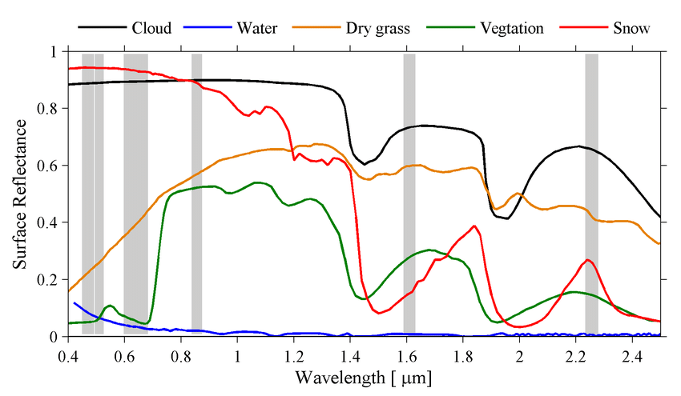

The aim of this document is to show how to handle **multispectral imagery** in `R` from major **publicly-available data archives**. These materials teach you the basic/intermediate concepts to retrieve, manage, and process satellite images locally (in your computer) in a simple and effective manner with `rsat`.

i.  Introduction - theory about multispectral images, data types and their organization.
ii. Tinkering with satellite `records` - standardizing and filtering image metadata.
iii. Managing your `rtoi` - building your region and time of interest - (yesterday).
iv. [**Basic processing - customizing images for the objectives of the study - (today).**]{.ul}
v.  More advance processing - completing and harmonizing multi-source data sets - (tomorrow).

------------------------------------------------------------------------

## Basic processing

Previous chapters focus on how to search and download satellite images for the region and time of interest, digging deep into `rsat` methods for handling `records` and `rtoi`s. This chapter moves forward and explains how to transform raw images into useful information. Specifically, Section \@ref(basic-mosaic) describes the mosaicking, a simple operation to improve the organization of the data set. Section \@ref(basic-index) describes the index calculation, i.e. how simple math applied to bands improve the analysis of earth system's distribution and dynamics. Finally, Section \@ref(basic-cloud), explores how to locate and remove cloudy pixels to avoid misinterpreting the surface reflectance.

------------------------------------------------------------------------

### Review

The aim of this walk-through is assessing the effects of the [Storm Filomena](https://en.wikipedia.org/wiki/2020%E2%80%9321_European_windstorm_season#Storm_Filomena) over the Iberian peninsula in terms of snow coverage. The storm was an extreme meteorological event (largest since 1971, according to AEMET) that took place between January 6th and 11th, 2021. This exercise is particularly challenging for two reasons; (1) the region of interest covers a wide area, thus requiring to process a vast amount of data, and (2) snow is visually very similar from clouds, so visual inspection is not enough to asses its extension. The assessment requires a new data-set, so let's search and download the appropriate imagery and take this opportunity to review the initial steps of `rsat`'s workflow.

#### Log-in

First, set the credentials to get access to the repositories of satellite images;

```{r cache.path="cache/"}
library(rsat)
set_credentials("rsat.package", "UpnaSSG.2021")
```

#### Region and time of interest (`rtoi`)

Define the region of interest (`roi`) and the time of interest (`toi`). Here, `roi` is a bounding box around the Iberian peninsula and `toi` is a collection of dates of the end of meteorological event. This is the time when it is more likely to see the consequences of the storm:

```{r basic_roi_toi}
roi <- st_sf(st_as_sfc(st_bbox(c(
  xmin = -9.755859,
  xmax =  4.746094,
  ymin = 35.91557,
  ymax = 44.02201 
), crs = 4326)))

toi <- seq(as.Date("2021-01-10"),as.Date("2021-01-15"),1)
```

The polygon specifies a ***Coordinate Reference System (CRS)***. The CRS helps interpreting the numbers associated to a location. For instance, the coordinates $(19,3)$ mean nothing unless we specify things such as the origin or the units. The CRS $4326$ is the longitude/latitude reference system. In [this](https://rspatial.org/raster/spatial/6-crs.html) website you can learn more about *CRS*, their types, and their strengths/weaknesses.

Remember that an `rtoi` requires two paths; one for itself (`rt.path`) and another for its parental database (`db.path`):

```{r basic_paths, eval=FALSE}
db.path <- "F:/CursoRSAT/DATABASE"
rt.path <- "F:/CursoRSAT/rtois"
dir.create(db.path, recursive = TRUE)
dir.create(rt.path, recursive = TRUE)
```

Then, create a new `rtoi` using the previous information:

```{r basic_rtoi}
filomena <- new_rtoi("filomena", roi, rt.path, db.path)
```

#### Search

MODIS spatio-temporal resolution (daily revisit and coarse resolution, see [here](https://drive.google.com/file/d/1cSw4LaTLPlGBHmG8v7uwH54f-m9jZz1N/view?usp=sharing)) might be suitable to explore the effects of Filomena in our ROI. Our task requires frequent images since snow melts quickly and clouds obstructing the view are frequent due to the storm and the season. Hence, search scenes of the [MOD09GA](https://lpdaac.usgs.gov/products/mod09gav006/) product:

```{r basic_search, eval=FALSE}
sat_search(region = filomena, product = c("mod09ga"), dates = toi)
print(filomena)
```

```{r, eval=FALSE}
# filomena <- read_rtoi("Z:/CursoRSAT/regions/spain_snow")
```

There are $24$ images concerning the Iberian peninsula during the $6$-day time span. Let's make sense of this results; first let's find the tiles intersecting the ROI;

```{r basic_tiles_intersect, eval=FALSE}
library(rsatExtra)
data("modis_tiles")
roi.sinu <- st_transform(roi, crs(modis_tiles))
tile.roi <- modis_tiles[roi.sinu,]
```

Inspect `tile.roi` with the following instructions;

```{r basic_tiles_show, eval=FALSE}
library(tmap)
tmap_mode("view")
tm_shape(tile.roi) + tm_polygons(alpha = 0, border.col = "red")
```

The map shows that there are $4$ MODIS tiles intersecting the Iberian peninsula (*h17v4, h17v5, h18v4,* and *h18v5*). Since MODIS revisits daily, there is $6 \,\text{days}\, \times 4 \, \text{tiles} = 24$. The same information can be extracted from the `records`:

```{r basic_tiles_records}
rcds <- as.data.frame(records(filomena))
rcds[, c("path", "row", "date")]
```

For a preview:

```{r basic_preview}
plot(filomena, "preview")
```

Let's pick the best images;

```{r eval=FALSE}
rcds <- records(filomena)
dtes <- as.Date("2021-01-11") + 0:2
rcds.f <- rcds[dates(rcds) %in% dtes]
records(filomena) <- rcds.f
```

#### Download

The final step of the review is the download of the satellite images:

```{r, eval=FALSE}
download(filomena)
```

------------------------------------------------------------------------

### Mosaic {#basic-mosaic}

Tiles sometimes extend way beyond our area of interest. Also, It may happen that several tiles intersect with our region of interest, that is, separate files contain fragments of the region under analysis with information of the same dates (see the picture below).

<center>


\<\center\>

***Mosaicking*** means binding together the tiles for the same date, so there is a single image per day. The function `mosaic()` finds automatically the images from the same date. Additionally, the function crops around the `roi` of an `rtoi` to remove unnecessary information and save space on your hard disk drive.

```{r, eval=FALSE}
mosaic(filomena)
# plot(filomena,"mod09ga",xsize=500,ysize=500)
```

------------------------------------------------------------------------

### Derive {#basic-index}

#### Definition

For any given material, the *reflectance* (remember the concept in Section \@ref(theory-images)) vary with the wavelength. Plotting wavelength vs. reflectance describes a characteristic curve that it is specific for each material. The curve is called ***spectral signature***. For instance, green vegetation absorbs red light due to chlorophyll and reflects *near-infrared* (*NIR*) due to structural tissues. This translates into lower reflectance values on the red band and higher reflectance values on the *NIR* band.

<center>

{width="470"}

\<\center\>

A ***remote sensing index*** is the result of simple math applied to the bands of an image to reveal the presence of a material. The computation involves the bands with a distinctively high or low reflectance. Over the years, researchers have developed a wide variety of indexes for different materials or processes which can be consulted [here](https://www.indexdatabase.de/db/i.php).

For instance, the *Normalized Difference Snow Index* (NDSI) (see e.g., [@ndsi2004]) highlights the snow using the *green* and *shortwave-infrared* bands (around $1.5 \mu m$). The subtraction of this two bands gives a large number for those pixels with snow. The denominator ensures that values oscillate between $-1$ and $1$.

$$ NDSI = \frac{Green - SWIR1}{Green + SWIR1}$$

#### Calculation

In `R` we can create a function replicating the calculation of the *NDSI:*

```{r basic_ndsi, eval = FALSE}
NDSI = function(green, swir1){
  ndsi <- (green - swir1)/(green + swir1)
  return(ndsi)
}
```

A nice feature of `rsat` is that the indexes can specify the bands by their names, e.g. *red, green, blue, etc.* rather than band number. Remember that numbers and spectra differ among mission/satellite. For instance, the *green* corresponds to the band number $4$ in MODIS and Landsat-7, number $3$ in Landsat-8 and Sentinel-2, and number $6$ in Sentinel-3 (see [here](https://drive.google.com/file/d/1cSw4LaTLPlGBHmG8v7uwH54f-m9jZz1N/view?usp=sharing)). Names enable to apply a unique custom function across satellites/missions. Some widespread variables are built-in the package. The list of variables can be printed using;

```{r basic_variables}
show_variables()
```

To use the `NDSI` function over the series of satellite images from the Iberian peninsula type;

```{r basic_derive, eval = FALSE}
derive(filomena, product = "mod09ga", variable = "ndsi", fun = NDSI)
```

Import the results into `R` using the `get_raster()` function. The numbers must be truncated between $-1$ and $1$ to avoid values outside the feasible range (sun reflections on mirror-like surfaces, such as water, can lead to misleading results):

```{r basic_ndsi_import, eval = FALSE}
ndsi.img <- get_raster(filomena, "mod09ga", "ndsi")
ndsi.img <- clamp(ndsi.img, -1, 1)
```

Let's display one of the results:

```{r basic_ndsi_plot, eval = FALSE}
library(tmap)
tm_shape(ndsi.img[[1]]) + tm_raster(style = "cont")
```

The *NDSI* index improves the separability between clouds and snow. However, there might be some difficulties distinguishing between them in certain parts of the image. Therefore, in the next step, cloud-covered pixels are removed.

### Deleting cloud-covered pixels

Some data providers apply algorithms over their data-sets to detect the presence of clouds (Level 1/2 products). The analysis is part of the quality assessment done during pre-processing and the results are included in the ***Quality Assurance*** (*QA*) band of the image. In addition to cloud coverage, the band provides information about over-saturated or filled pixels. The information is packed in this band using the bit format.

The function `cloud_mask()` interprets the *QA* band to obtain images showing the presence/absence of clouds. Its application is straightforward;

```{r basic_cloud, eval=FALSE}
cloud_mask(filomena)
```

For every image in the `rtoi`, the function generates a new image, called ***mask***, in which $1$s and $NA$s indicate clear and covered pixels. The function identifies the mission/program and applies the appropriate interpretation of bits to create the cloud mask. To import the result run;

```{r basic_mask, eval = FALSE}
clds.msk <- get_raster(filomena, "mod09ga", "CloudMask")
```

In MODIS, cloud-masks have a different resolution than the multispectral image. To adjust the resolution, *resample* the image (`resample()`) using the nearest neighbor method (`"ngb"`).


```{r basic_mask_resample}
clds.msk <- resample(clds.msk, ndsi.img, method = "ngb")
```

To apply the cloud mask, we just multiply both series of pixels. Dot multiplications are performed pixel-wise. *NDSI* values multiplied by $1$ remain unaltered but those multiplied by $NA$ become missing:

```{r basic_mask_apply}
ndsi.filt <- ndsi.img * clds.msk
names(ndsi.filt) <- names(clds.msk) # keep the names
```

As an attempt to obtain a ***composite image***, we extract maximum value of the *NDSI* for each pixel in the time series. Maximum value compositions are frequent in this field [@mvc1986]. Compositing is as a way to summarize the information in a time-lapse and ignore the presence of clouds:

```{r basic_composite}
snow.spain <- calc(ndsi.filt, max, na.rm = TRUE)
```

Represent the results;

```{r basic_ndsi_map}
tm_shape(snow.spain) + tm_raster(style = "cont")
```

------------------------------------------------------------------------

## Exercise

The results from our assessment are not entirely satisfactory. Some areas remain permanently covered by clouds which leads to data gaps in our final image. As a way to improve the results, repeat the exercise but this time, think about strategies to increase the amount of data. This way, there is a higher chance to find those pixels clear at some point in the time series.

```{r}

```
