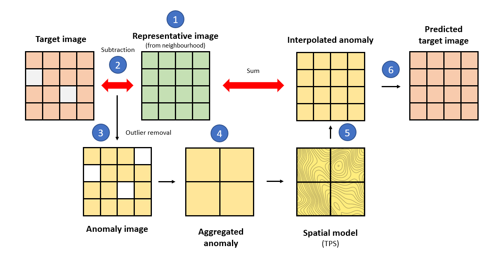

The aim of this document is to show how to handle **multispectral imagery** in `R` from major **publicly-available data archives**. These materials teach you the basic/intermediate concepts to retrieve, manage, and process satellite images locally (in your computer) in a simple and effective manner with `rsat`.

i.  Introduction - theory about multispectral images, data types and their organization.
ii. Tinkering with satellite `records` - standardizing and filtering image metadata.
iii. Managing your `rtoi` - building your region and time of interest.
iv. Basic processing - customizing images for the objectives of the study - (yesterday)
v.  [**More advance processing - completing and harmonizing multi-source data sets - (today).**]{.ul}

------------------------------------------------------------------------

## Advance processing

Previous chapters explain how to search, download, and process satellite images to fit the goals of our analysis. Studies frequently experience problems due to data gaps and outliers caused by clouds and sensor errors. Another problem might be that that the resolution of single mission is not enough for an adequate spatio-temporal resolution. In this section we introduce two mathematical/statistical methods implemented in `rsat` (or `rsatExtra`) to solve these issues.

The package provides the ***Interpolation of Mean Anomalies (IMA),*** an algorithm that *fills* the gaps and *smooths* outliers in a time-series of images (Section \@ref(filling)). The results is a complete and continuous remote sensing data-set. The *extension* package contains a collection of experimental functions to improve the spatio-temporal resolution of images. Functions allow to combine scenes from multiple satellites through spatio-temporal fusion (Section \@ref(fusion)).

------------------------------------------------------------------------

### Filling missing data {#filling}

#### Theoretical background

As mentioned earlier, cloud removal or sensor failures can lead to data gaps in time-series of satellite images. Additionally, noise from aerosols, dust, and sensor measurement errors can reduce the quality of the remotely sensed data. The ***Interpolation of Mean Anomalies (IMA***) is a gap-filling and smoothing approach that mitigates these issues [@ima2019]. `rsat` implements a generic version of the algorithm with the function `smoothing_image()`.

{width="559"}

For the theoretical explanation, let's assume $15$ images have been downloaded and processed (squares in the image above). The imagery corresponds to $5$ consecutive days over $3$ years. Consider that we are willing to fill/smooth the target image (red square). *IMA* fills the gaps borrowing information from an *adaptable* temporal neighborhood (yellow squares). Two parameters determine the size of the neighborhood; the number of days before and after the target image (`nDays`) and the number of previous and subsequent years (`nYears`). Both parameters should be adjusted based on the temporal resolution of the of the time-series of images. We recommend that the neighborhood extends over days rather than years, when there is little resemblance between seasons. Also, cloudy series may require larger neighborhoods.



*IMA* gives the following steps; (1) creates a representative image of the neighborhood ignoring missing values e.g., doing the mean, median, etc. for each pixel's time-series (`fun`), (2) the target and representative images are subtracted giving an image of *anomalies*, (3) the *anomalies* falling outside the quantile limits (`aFilter`) are considered outliers and therefore removed, (4) it aggregates the anomaly image into a coarser resolution (`fact`) to reveal potential spatial dependencies, (5) the procedure fits a spatial model (thin plate splines or *TPS*) to the anomalies which is then used to interpolate the values at the original resolution, and (6) the output is the sum of the interpolated anomalies and the average image. The process is encapsulated in `smoothing_image()` and the section below shows its usage.

------------------------------------------------------------------------

#### Hands-on demonstration

##### Data

Let's start where we left off in the previous chapter. Load the series of the *Normalized Difference Snow Index* of the Iberian Peninsula from January $10^{th}$ to $15^{th}$ , $2021$. The scenes are available in `rsatExtra` and can be loaded as follows;

```{r advanced_ima_data}
library(rsatExtra)
data("ndsi-spain")
```

The showcase is restricted to Valencia, an eastern region of Spain, to reduce the computational demand of the analysis. Use the *Global Administrative Boundaries* data-set from `raster` to load the border of Valencia as a `SpaitalPolygons`;

```{r advanced_ima_border}
spain <- getData("GADM", country = "ESP", level = 1)
valen <- spain[spain$NAME_1 == "Comunidad Valenciana",]
```

The image and the polygon use a different ***Coordinate Reference System (CRS)***. The CRS helps interpreting the numbers associated to a location. For instance, the coordinates $(19,3)$ mean nothing unless we specify things such as the origin or the units. In [this](https://rspatial.org/raster/spatial/6-crs.html) website you can learn more about *CRS*, their types, and their strengths/weaknesses. For us, it is enough to realize that they are different and to know how to transform them;

```{r advanced_ima_reproj}
crs(ndsi.filt)
crs(valen)
valen <- spTransform(valen, crs(ndsi.filt))
```

Let's cut the image of the Peninsula to the extension of Valencia;

```{r advanced_ima_crop}
ndsi.v <- crop(ndsi.filt, valen)
```

And check the results:

```{r advanced_ima_show}
library(tmap)
tm_shape(ndsi.v) + tm_raster(style = "cont")
```

##### Interpolation of Mean Anomalies

The instruction below applies the *IMA* on the $3^{rd}$ image taking a temporal neighborhood of $2$ days, using the `mean` to generate the representative image, using the frequent $5-95$ quantile range, and aggregating the anomalies at a factor of $10$ (every $10$ pixels are aggregated into $1$):

```{r advanced_ima}
library(rsat)
ndsi.fill <- smoothing_images(method = "IMA",
                              ndsi.v,
                              Img2Fill = 3,
                              nDays = 2,
                              nYears = 0,
                              fun = mean,
                              aFilter = c(0.01,0.91),
                              fact = 10,
                              only.na = TRUE)
```

Note the last argument `only.na = TRUE`, which means that the prediction is only made for the missing pixels while the observed values are preserved. Let's make a comparison between *before* and *after* the application of *IMA.*

```{r advanced_ima_result}
before <- mask(ndsi.v[[3]], valen)
after <- mask(ndsi.fill, valen)
tm_shape(stack(before,after)) + tm_raster(style = "cont")
```

*IMA* has shown to be competitive in prediction performance. It also outperforms other classical alternatives (*Timesat, Hants,* and *Gapfill*) in computational efficiency [@ima2019].

------------------------------------------------------------------------

#### Exercise

Your turn: Conversely to *composites,* which summarize the information over a time period (remember Chapter \@ref(basic-processing)), *IMA* preserves as much data as possible filling the missing values and leaving the existing ones. To emphasize this difference, apply *IMA* to the whole series of images. To do this automatically, remove the `Img2Fill` argument. This way, the function iterates over `ndsi.fill`, using as a target image every image of the sequence. Plot the results and comment about the outputs.

```{r advanced_ima_exercise, eval = FALSE}

```

```{r stif_clear, echo = FALSE}
rm(list = ls())
```

------------------------------------------------------------------------

### Spatio-Temporal Image Fusion (STIF) {#fusion}

*STIF* is an undergoing line of research [in our research group](https://spatialstatisticsupna.github.io/) and so the software might be unstable. Therefore, functions are provisionally provided in `rsatExtra` until we find the best way to automate and integrate this process into `rsat`'s ecosystem:

```{r stif_install}
library(rsatExtra)
```

#### Aim

Sometimes, using the satellites from a single mission is not enough to achieve an adequate spatio-temporal resolution to achieve the study goal. ***STIF methods*** increase the spatio-temporal resolution of satellite images by blending two sources of satellite images with complementary resolutions (spatial and temporal)[@stif2019]. For instance, MODIS (*`MOD09GA`*) provides daily images with a resolution of $500 \times 500m$. Landsat acquires images every $16$ days with a resolution of $30m$. The goal of *STIF* models is to obtain daily images at $30m$ combining MODIS and Landsat. *STIF* techniques have proven valuable to improve the accuracy of studies in ecology or agronomy.

{width="347"}

The aim of this demonstration is predicting a Landsat-like image on `24/11/2001` using a MODIS image captured on that date (`mod2`). The *STIF* method also requires a pair of Landsat-7 (`lst1`) and MODIS scenes (`mod1`) captured simultaneously. The closest pair of cloud free images is available on `08/11/2001`. The following code loads the data-set in `R`:

```{r stif_data, eval = FALSE}
data("extra-data")
```

The *ROI* is an agricultural region in Australia called Coleambally Irrigation Area [@extradata2013]. Let's display `lst1` and `mod1` (Landsat and MODIS image on `08/11/2001`) to visualize the area and explore Landsat-MODIS resolution difference:

```{r stif_data_map}
# install.packages("mapview")
library(mapview)
viewRGB(lst1) + viewRGB(mod1)
```

#### Co-registration

Blending images from multiple sources requires additional processing to the application of *STIF* models. Scenes from different satellites or dates may not be perfectly aligned between them due to small errors georeferencing their pixels. Fusion is very sensitive to registration errors and they can have a detrimental effect on accuracy[@coregistration2020]. To minimize the effect, their **c*o-registration*** is recommended. *Co-registration* is the process of realigning the images to improve the spatial correspondence between them. A simple and popular co-registration technique shifts two images horizontally and vertically to find the position that maximizes the correspondence between them.

The function `coregister()` from `rsatExtra` applies the co-registration method explained before to find the best shift automatically. The function `coregister()`, originally from `RSToolbox` [@rstoolbox2019], is part of `rsatExtra` for convenience. The first argument in `coregister()` is the moving image (`s1`) while the second one remains fixed (`s2`). Usually, the image of higher resolution is the reference because is less prone to geometric errors. The function also requires the total distance to be shifted (`xy.shifts`) and the increment of every step in the sequence (`shiftInc`). Let's try moving the MODIS image $250m$ left-right and up-down (i.e., 0.5 times a MODIS pixel) in steps of $25m$;

```{r stif_coreg_mod1_find, eval = FALSE}
shifts <- coregister(mod1, lst1, xy.shift = 250, shiftInc = 25)
shifts$optimal
```

To apply the correction on `mod1`;

```{r stif_coreg_mod1_apply}
mod1.cor <- shift(mod1, dx = shifts$optimal[1], dy = shifts$optimal[2])
```

Let's see the results;

```{r stif_coreg_result, eval = FALSE}
viewRGB(mod1) + viewRGB(lst1) + viewRGB(mod1.cor)
```

The alignment between `mod1.cor` and `mod2` should be checked. Remember that `lst2` is what we are trying to predict and therefore does not exist. The next line of code ensures that one single `mod2` pixel matches an entire `mod1.cor` pixel;

```{r stif_coreg_mod2_match, eval = FALSE}
mod2 <- resample(mod2, mod1.cor, method = "ngb")
```

Then, we move `mod2` over `mod1.cor` one pixel at a time on the horizontal and vertical axis to make sure that the content of the pixels match;

```{r stif_coreg_mod2_findapply, eval = FALSE}
shifts <- coregister(mod2, mod1.cor, xy.shift = 920, shiftInc = 460)
shifts$optimal
mod2.cor <- shift(mod2, dx = shifts$optimal[1],dy = shifts$optimal[2])
```

Let's see the results;

```{r stif_coreg_result, eval = FALSE}
viewRGB(mod1.cor) + viewRGB(mod2) + viewRGB(mod2.cor)
```

#### Relative radiometric correction

Another aspect to consider is the difference between bands from distinct sensors (see the differences between bands [here](https://drive.google.com/file/d/1cSw4LaTLPlGBHmG8v7uwH54f-m9jZz1N/view?usp=sharing)). For instance, the *red* band from MODIS and Landsat-7 corresponds to $620-670nm$ and around $630-690nm$, respectively. The consistency is high but even small differences can lead to prediction bias. To tackle the problem we must apply a ***relative radiometric correction*****.** Relative correction brings each band of a sensor to the radiometric scale of another sensor. The method implemented in `rsatExtra` is described in [@radiocor2020]. It applies a local linear regressions to convert from one band to another. Local means that image is split into overlapping chunks and regressions are fitted to each of them.

{width="382"}

`rsatExtra` provides the `radiocor_fit()` to perform the relative radiometric correction. Remember that the relative radiometric correction means re-scaling the bands of one sensor to another. Our aim is to obtain a Landsat-like image, so MODIS bands must be transformed into Landsat-7 bands. The function `radiocor_fit()` takes the two lists of multispectral images (`x` and `y`). The elements of the lists must be named as their corresponding dates. The argument `y` is the reference sensor and `x` is the one to be modified. The function fits linear regressions locally using a moving window. Based on the literature [@radiocor2020], we set the window size to $5$ (always an odd number):

```{r stif_rad_fit, eval = FALSE}
library(stars)
mod1.hat <- warp_stack(lst1, mod1.cor, method = "average", usegdal = TRUE)
rad.par <- radiocor_fit(x = list(`2001-11-08` = mod1.cor),
                        y = list(`2001-11-08` = mod1.hat),
                        wndw = 5)
```

Based on the assumption that relative radiometric correction parameters are constant over shorts periods of time, we apply the same coefficients from the MODIS image on `08/11/2001` to the other one captured on `24/11/2001`:

```{r stif_rad_apply, eval = FALSE}
mod1.new <- rad.par$slope * mod1.cor + rad.par$inter
mod2.new <- rad.par$slope * mod2.cor + rad.par$inter
```

To see the overall correction effect:

```{r stif_rad_show}
viewRGB(lst1) + viewRGB(mod1) + viewRGB(mod1.new)
```

#### STIF modeling

The two steps from above result into spatially and spectrally consistent images to which the fusion model can be applied. Many *STIF* methods exist but the ***Fit-FC*** model, developed by Wang [@fitfc2018], is the most computationally efficient and one of the most accurate [@stifreview2021]. ***Fit-FC*** predicts the high-resolution image on a particular day from: (a) a low-resolution image of the same day (*coarse t2*) and (b) a matching pair of high and low resolution images (*fine* and *coarse t1*) from another day. The difference between the matching pairs disentangles the spatial patterns and relationship between fine and coarse. The difference between the two low resolution images provide information about the temporal changes. Temporal changes and spatial patterns are integrated to give the final prediction.


The function `stif_fitfc()`applies the *Fit-FC* technique on individual images. The (minimum) number arguments to be defined are the matching pair of high (`f1`) and low (`c1`) spatial resolution images, and the low resolution image for the time of prediction (`c2`). The function has other parameters but they go beyond the scope of this short course. For further information about this method and its parameters read [@fitfc2018]. In our example, it is applied as follows:

```{r stif_fitfc, eval = FALSE, message = FALSE, warnings = FALSE}
lst2.hat <- stif_fitfc(f1 = lst1, c1 = mod1.new, c2 = mod2.new)
```

Let's inspect the result;

```{r stif_compare}
viewRGB(mod2.new) + viewRGB(lst2.hat)
```

The prediction is a little bit blurry in heterogeneous areas of the images (bottom-right corner). The MODIS-Landsat fusion entails a zooming factor of $\times 17$ and therefore represents a big challenge. Fusions such as Landsat-Sentinel likely produce better results. Also, we want to highlight that *Fit-FC,* as many other *STIF* require matching pairs of clear-sky images. Depending on the location and time of the year, it can be difficult to fulfill both requirements. In the group, we are working to publish a method that eliminates both restrictions.

------------------------------------------------------------------------

#### Exercise

Your turn: Find the original data-set for the demonstration. Search MODIS (*`MOD09GA`*) and Landsat-7 (`LANDSAT_TM_C1`) images during November $2001$. Display a calendar with the results and pay special attention to matching MODIS-Landsat pairs. Preview the scenes on those dates with matching pairs to make sure that they are cloud-free ([***do not download!***]{.ul}). This would be your input together with a temporally close MODIS target. If you want to be challenged, try to define the *ROI* yourself. Otherwise, use the polygon provided below;

```{r}
library(rsat)
roi <- st_sf(st_as_sfc(st_bbox(c(
  xmin = 145.6974,
  xmax = 146.0336,
  ymin = -35.06052,
  ymax = -34.76109
), crs = 4326)))
```
